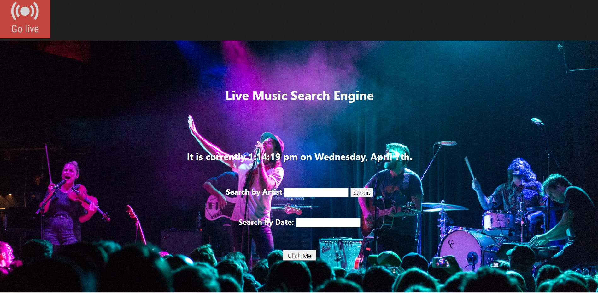

<!-- PROJECT LOGO -->
<br />
<p>
    
  </a>

  <h3 >MUSICAL</h3>

  

<!-- TABLE OF CONTENTS -->
<details open="open">
  <summary>Table of Contents</summary>
  <ul>
    <li>
      <a href="#about-the-project">About The Project</a>
      <ul>
        <li><a href="#User Story">User Story</a></li>
        <li><a href="#Acceptance Criteria">Acceptanc Criteria</a></li>
        <li><a href="Aplication Requiremnets">Aplication Requirements</a></li>
          <li><a href="#built-with">Built With</a></li>
         <li><a href="#Screenshot">Screenshot</a></li>
        <li><a href="#Links">Links</a></li>
        <li><a href="#Contributors">Contributors</a></li>
      </ul>
    </li>
    </ul>
</details>


## About The Project
```
This project is a Search Engine for Live Music.
```
## User Story
```
As a user I WANT to find live music events in the United States
SO THAT I can learn more about  local music artists.
As a user I can search by Artist name or by Date.
As a user I will be able to also find youtube videos for the Artist being searched.
```
## Acceptance Criteria
```
As a user when I open the page am presented by two search options 
to search for Live Music 
* one search button is by Artist name and 
* another is by date ,
* When I search by name  
* Then am presented by all the artist events
* When I search by Date 
* Then am presented by with all events happening on that date,
* When   
```
## Application Requirements
```
Our project has fulfilled the following requirements:
 * Use a CSS framework other than bootstrap
 * Deployed to GitHub pages
 * Interactive 
 * Two server side API'S
 * Does not use alerts, confirms, or prompts
 * Use of client-side storage to store persistant data
 * Responsive 
 * Have a polished UI.
 * Have a clean repository that meets quality coding standards (file structure, naming conventions, follows best practices for class/id naming conventions, indentation, quality comments, etc.)
 * Have a quality README (with unique name, description, technologies used, screenshot, and link to deployed application).
```

### API's
-   Youtube API
-   TicketsMaster API

``
### Built With

* [Bulma](https://bulma.io)
* [JQuery](https://jquery.com)
* [Foundation](https://get.foundation)
* [Moment](https://momentjs.com/)
## link
[link](https://github.com/crsmith01/Musical)

## screenshot


## Brought To You by:
``
* [Catherine Smith](https://github.com/crsmith01)
* [Shaima Jobran](https://github.com/shaimajobran)
* [Randy Faison ](https://github.com/randyfasion)
* [Brian Carroll]

